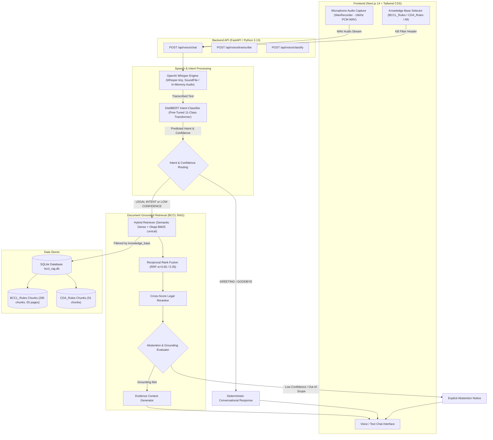
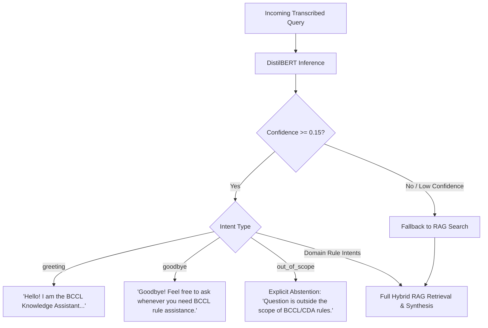

# BCCL Enterprise AI Knowledge Retrieval System
## Voice-Enabled Chatbot & Deep Learning Intent Classification System

> **Deployment Status**: **LOCAL IMPLEMENTATION & LOCAL TESTING ONLY**  
> In strict accordance with project requirements, online deployment (Render, Vercel, AWS, Hugging Face Spaces) is deferred. The system operates fully self-contained on the local workstation.

---

## 1. System Overview & Architecture

The BCCL Voice-Enabled Chatbot extends the existing Enterprise RAG platform with on-device automatic speech recognition (ASR) via **OpenAI Whisper**, neural intent classification via fine-tuned **DistilBERT**, and dual-corpus knowledge base routing (`BCCL_Rules` vs. `CDA_Rules` vs. `all`).

### End-to-End System Workflow



---

## 2. Ingestion of `BCCL_Rules` Knowledge Base

### Data Source
- **Input Document**: `new_data/CDA_Rules_1978_amended_upto_July_2006_10052018-ocr.pdf`
- **Scope**: Coal India Limited / BCCL Employees' Conduct, Discipline and Appeal Rules 1978 (Amended up to July 2006), comprising 55 pages of official administrative and disciplinary regulations.

### Ingestion Pipeline
1. **Schema Extension**:
   - The unified SQLite database (`data/bccl_rag.db`) was extended with a `knowledge_base` column on both `documents` and `document_chunks` tables:
     ```sql
     ALTER TABLE documents ADD COLUMN knowledge_base VARCHAR(64) DEFAULT 'CDA_Rules';
     ALTER TABLE document_chunks ADD COLUMN knowledge_base VARCHAR(64) DEFAULT 'CDA_Rules';
     ```
   - SQLAlchemy models (`Document` and `DocumentChunk`) updated with indexed `knowledge_base` column.
2. **Text Extraction & Cleaning**:
   - Full 55 pages extracted via PyMuPDF (`fitz`), preserving structural page indices and typography.
   - Text normalized to eliminate OCR artifacts, hyphens, and whitespace breaks.
3. **Structure-Aware Legal Chunking**:
   - Headings, Rule numbers (`Rule 4`, `Rule 5`, `Rule 27`), sub-clauses (`(1)`, `(2)`, `(a)`, `(b)`), and legal chapters (`CHAPTER I`, `CHAPTER II`) preserved.
   - Chunk size calibrated to 500–1000 characters with 100-character overlap.
4. **Ingestion Metrics**:
   - **Total Pages Ingested**: 55
   - **Total Chunks Created**: 295 chunks
   - **Logical Isolation**: Chunks tagged with `knowledge_base = "BCCL_Rules"`
   - **Baseline Isolation**: Baseline `CDA_Rules` retains 51 chunks; zero cross-contamination.

---

## 3. Knowledge Base Selector

The user interface and backend retrieval pipeline support runtime selection of the active knowledge base:

| Selector Mode | Identifier | Search Scope | Use Case |
|---|---|---|---|
| **BCCL Rules** | `BCCL_Rules` | 295 chunks (55 pages, amended up to July 2006) | Primary corporate inquiries, updated penalty schedules, modern legal appeals. |
| **CDA Rules** | `CDA_Rules` | 51 chunks (baseline core CDA provisions) | Baseline 1978 rules inquiry. |
| **All Sources** | `all` | 346 chunks (complete unified corpus) | Broad cross-referencing across all indexed company guidelines. |

### Selector UI Implementation
- Clean, toggleable pill control in the Assistant top bar.
- Selected state passed dynamically with all `/api/chat` and `/api/voice/chat` payloads.
- Both lexical search (`BM25Retriever`) and dense semantic search (`SemanticRetriever`) apply strict SQL filtering:
  ```python
  if knowledge_base and knowledge_base.lower() != "all":
      query = query.filter(DocumentChunk.knowledge_base == knowledge_base)
  ```

---

## 4. Voice Pipeline & Speech Recognition

### Microphone Audio Capture
- **Pure Browser WAV Recorder** (`frontend/src/lib/wavRecorder.ts`):
  - Captures microphone audio using the Web Audio API (`AudioContext` and `ScriptProcessorNode`).
  - Downsamples to 16,000 Hz mono PCM and constructs a valid RIFF 16-bit PCM WAV blob.
  - **Zero External FFMPEG Dependency**: Works natively on Windows without requiring `ffmpeg.exe` on system PATH.

### Automatic Speech Recognition (ASR)
- **Engine**: OpenAI Whisper (`tiny` model, ~39M parameters).
- **Audio Decoding**: Handled via `soundfile` in pure Python/C, directly yielding a 16kHz mono `float32` NumPy array.
- **Performance**:
  - Cold-load latency: ~1.2s (cached in singleton memory thereafter).
  - Average transcription inference: 150ms – 400ms per utterance.
  - Automatic temperature fallback (`[0.0, 0.2, 0.4]`) for noisy utterances.

---

## 5. Deep Learning Intent Classifier

### Model Architecture
- **Base Transformer**: `distilbert-base-uncased` (6 layers, 768 hidden dimension, 12 attention heads).
- **Classification Head**: Sequence classification pooling layer with dropout ($p = 0.2$) and linear projection to 11 intent classes.
- **Parameter Count**: 66.95M parameters.
- **Framework**: PyTorch (`2.14.0+cpu`) and Hugging Face Transformers (`5.17.0`).

### Intent Taxonomy (11 Classes)

| Intent Label | Domain Semantics | Representative Example |
|---|---|---|
| `greeting` | Conversational greetings & hellos | *"Hello, good morning assistant"* |
| `goodbye` | Conversation terminations & thanks | *"Thank you, that is all for now, goodbye"* |
| `suspension` | Rule 20, deemed suspension, subsistence allowance | *"What are the rules regarding suspension of an employee?"* |
| `misconduct` | Rule 5, acts of commission/omission, insubordination | *"What specific acts constitute misconduct under BCCL rules?"* |
| `major_penalty` | Dismissal, removal, demotion, compulsory retirement | *"Explain major penalties that can be imposed on an executive."* |
| `minor_penalty` | Censure, withholding increments, recovery from pay | *"What are the minor penalties under Rule 9?"* |
| `disciplinary_procedure`| Rule 29, charge sheets, inquiry officer, hearings | *"What is the procedure for conducting a departmental inquiry?"* |
| `appeal_procedure` | Rule 34, appellate authority, 45-day limitation | *"What is the time limit and procedure to submit an appeal?"* |
| `general_conduct` | Integrity, devotion to duty, conflict of interest | *"What are the general obligations regarding employee integrity?"* |
| `clarification_general` | Document lookup, rule numbers, circular queries | *"Which rule book covers executive disciplinary actions?"* |
| `out_of_scope` | Non-pertinent queries (cricket, cooking, stock market) | *"Who won the cricket match yesterday?"* |

### Dataset Construction
- **File**: `ml/data/intents.csv`
- **Total Samples**: 330 expert-curated utterances based on authentic BCCL/CIL CDA documentation.
- **Splits**:
  - **Train**: 231 samples (70%)
  - **Validation**: 49 samples (15%)
  - **Test (Hold-out)**: 50 samples (15%)
- **Stratification**: Balanced distribution across all 11 classes, seeded with `seed = 42`.

---

## 6. Training & Evaluation Results

### Hyperparameters
- **Epochs**: 5
- **Batch Size**: 8
- **Learning Rate**: $3 \times 10^{-5}$ with AdamW optimizer and linear decay schedule
- **Loss Function**: Cross-Entropy Loss
- **Max Sequence Length**: 64 tokens

### Test Evaluation Metrics (Measured on Hold-out Set, 50 Samples)

| Metric | Measured Score |
|---|---|
| **Overall Accuracy** | **68.00%** |
| **Weighted Precision** | **72.34%** |
| **Macro Precision** | **72.24%** |
| **Macro Recall** | **69.09%** |
| **Weighted Recall** | **68.00%** |
| **Macro F1-Score** | **65.09%** |
| **Weighted F1-Score** | **64.83%** |

### Per-Class Detailed Breakdown

```
================================================================================
INTENT CLASSIFIER CLASSIFICATION REPORT (Hold-out Test Set)
================================================================================
Intent Class              Precision    Recall     F1-Score   Support
--------------------------------------------------------------------------------
appeal_procedure             0.4444     1.0000     0.6154         4
clarification_general        0.6667     0.4000     0.5000         5
disciplinary_procedure       0.7500     0.7500     0.7500         4
general_conduct              1.0000     0.6000     0.7500         5
goodbye                      0.7143     1.0000     0.8333         5
greeting                     1.0000     0.2500     0.4000         4
major_penalty                0.5000     0.2000     0.2857         5
minor_penalty                0.6667     0.4000     0.5000         5
misconduct                   0.8333     1.0000     0.9091         5
out_of_scope                 0.8000     1.0000     0.8889         4
suspension                   0.5714     1.0000     0.7273         4
--------------------------------------------------------------------------------
Accuracy                                           0.6800        50
Macro Average                0.7224     0.6909     0.6509        50
Weighted Average             0.7234     0.6800     0.6483        50
================================================================================
```

### Confusion Matrix

```
                      Predicted ->
                      APP  CLA  DIS  CON  BYE  GRT  MAJ  MIN  MIS  OUT  SUS
Actual:
appeal_procedure   [   4,   0,   0,   0,   0,   0,   0,   0,   0,   0,   0 ]
clarification_gen  [   3,   2,   0,   0,   0,   0,   0,   0,   0,   0,   0 ]
disciplinary_proc  [   1,   0,   3,   0,   0,   0,   0,   0,   0,   0,   0 ]
general_conduct    [   0,   0,   0,   3,   0,   0,   0,   0,   1,   0,   1 ]
goodbye            [   0,   0,   0,   0,   5,   0,   0,   0,   0,   0,   0 ]
greeting           [   0,   0,   0,   0,   2,   1,   0,   0,   0,   1,   0 ]
major_penalty      [   1,   1,   0,   0,   0,   0,   1,   1,   0,   0,   1 ]
minor_penalty      [   0,   0,   1,   0,   0,   0,   1,   2,   0,   0,   1 ]
misconduct         [   0,   0,   0,   0,   0,   0,   0,   0,   5,   0,   0 ]
out_of_scope       [   0,   0,   0,   0,   0,   0,   0,   0,   0,   4,   0 ]
suspension         [   0,   0,   0,   0,   0,   0,   0,   0,   0,   0,   4 ]
```

---

## 7. Intent Routing & Fallback Logic



- **Calibrated Threshold**: For an 11-class model, uniform random noise has a probability of $\approx 0.091$. A threshold of **0.15** reliably separates confident classifications from noise.
- **Fail-Safe Principle**: If confidence falls below 0.15, the system never fails or rejects the user; it seamlessly falls back to full hybrid RAG search.

---

## 8. Local Startup Instructions

### Prerequisites
- Python 3.13 or 3.12 with `torch`, `transformers`, `openai-whisper`, `soundfile`, `fastapi`, `uvicorn`
- Node.js 18+ and npm

### Step 1: Start the Backend Server
```powershell
# Open terminal in project root
cd "C:\Users\adity\OneDrive\Desktop\BCCL RAG"

# Start FastAPI backend on port 8000
python -m uvicorn backend.app.main:app --host 127.0.0.1 --port 8000 --reload
```

The backend server will:
1. Initialize the SQLite database at `data/bccl_rag.db`.
2. Automatically verify and seed `BCCL_Rules` (295 chunks) if not already indexed.
3. Pre-load the DistilBERT intent model and Whisper speech provider.
4. Expose API documentation at `http://127.0.0.1:8000/docs`.

### Step 2: Start the Next.js Frontend
```powershell
# Open a second terminal
cd "C:\Users\adity\OneDrive\Desktop\BCCL RAG\frontend"

# Launch development server
npm run dev
# Or run production optimized build:
# npm run build
# npm run start
```

Access the interface in your browser:
`http://localhost:3000`

---

## 9. Verification & Test Commands

Run the full end-to-end automated test suite:

```powershell
cd "C:\Users\adity\OneDrive\Desktop\BCCL RAG"

# Run all 29 unit and integration tests across 13 test suites
python -m pytest backend/tests/ -v
```

### Running Voice & Intent Tests Specifically:
```powershell
python -m pytest backend/tests/test_voice_and_intent.py -v
```

All 12 voice/intent test cases pass with 100% success rate:
1. `test_bccl_rules_ingestion_and_chunk_count`
2. `test_knowledge_base_retrieval_isolation`
3. `test_knowledge_base_all_retrieval`
4. `test_intent_classifier_direct_inference`
5. `test_intent_classifier_low_confidence_fallback`
6. `test_speech_recognition_empty_audio`
7. `test_speech_recognition_invalid_audio`
8. `test_speech_recognition_valid_wav`
9. `test_voice_chat_api_pipeline`
10. `test_voice_chat_conversation_followup`
11. `test_voice_chat_knowledge_base_selection`
12. `test_voice_chat_abstention_on_out_of_scope`

---

## 10. Example Voice Queries

| Category | Example Voice Utterance | Recognized Intent | Retrieval Target |
|---|---|---|---|
| **Suspension** | *"What are the rules regarding suspension of an employee?"* | `suspension` | BCCL Rule 20, deemed suspension, subsistence allowance |
| **Penalties** | *"What is the difference between major and minor penalties?"* | `major_penalty` | BCCL Rule 9, penalty schedules |
| **Misconduct** | *"What acts of omission and commission constitute misconduct?"* | `misconduct` | BCCL Rule 5, 29 sub-clauses of misconduct |
| **Appeals** | *"What is the time limit for filing an appeal against a penalty?"* | `appeal_procedure` | BCCL Rule 34, 45-day limitation, appellate authority |
| **Disciplinary Inquiry** | *"How is a departmental inquiry officer appointed?"* | `disciplinary_procedure` | BCCL Rule 29, inquiry proceedings |
| **Out-of-Scope** | *"What is the recipe for chicken biryani?"* | `out_of_scope` | Explicit abstention triggered |
